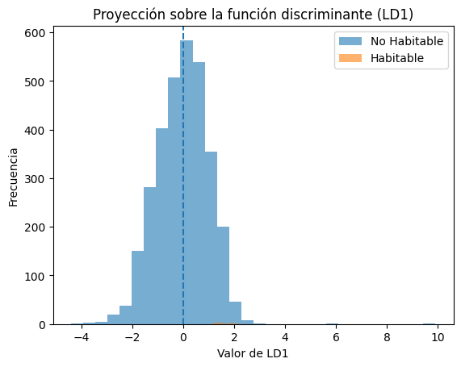

### Modelo LDA (Linear Discriminant Analysis)

En este apartado se explora la creación de un modelo de clasificacion por medio de un Discriminante lineal.

### Crear modelo


> Python Code


```python
from sklearn.discriminant_analysis import LinearDiscriminantAnalysis
from sklearn.metrics import classification_report, confusion_matrix, accuracy_score

# Crear modelo
lda = LinearDiscriminantAnalysis()

# Entrenar
lda.fit(X_train, y_train)

# Predicciones
y_pred = lda.predict(X_test)
```


Ya que creamos el modelo y lo entrenamos, veamos algunas de sus metricas, como la matriz de confusión, F1 score, accuracy, entre otros.


> Python Code


```python
from sklearn.discriminant_analysis import LinearDiscriminantAnalysis
from sklearn.metrics import classification_report, confusion_matrix, accuracy_score

# Crear modelo
lda = LinearDiscriminantAnalysis()

# Entrenar
lda.fit(X_train, y_train)

# Predicciones
y_pred = lda.predict(X_test)
```


>Output


```text
Accuracy: 0.9817518248175182

Matriz de Confusión:
[[1345    2]
 [  23    0]]

Reporte de Clasificación:
              precision    recall  f1-score   support

           0       0.98      1.00      0.99      1347
           1       0.00      0.00      0.00        23

    accuracy                           0.98      1370
   macro avg       0.49      0.50      0.50      1370
weighted avg       0.97      0.98      0.97      1370

```

###Ver funciones discriminantes y coeficientes
Con el fin de poder comprender un poco mas como se comporta nuestro modelo, veamos la funcion disciminante y los coeficientes que tenemos


>Python Code


```python
import pandas as pd

coef_df = pd.DataFrame({
    "Variable": X_train.columns,
    "Coeficiente": lda.coef_[0]
})

coef_df = coef_df.sort_values(by="Coeficiente", key=abs, ascending=False)

print(coef_df)
```


>Output


```text
   Variable  Coeficiente
3    st_rad     0.393032
0    pl_eqt    -0.003944
1  pl_insol     0.000692
2   st_teff    -0.000613
```

### Visualizar la función discriminante 

>Python Code


```python
import matplotlib.pyplot as plt
import numpy as np

# Proyección en LD1
X_train_lda = lda.transform(X_train)

plt.figure()
plt.hist(X_train_lda[y_train==0], bins=30, alpha=0.6, label="No Habitable")
plt.hist(X_train_lda[y_train==1], bins=30, alpha=0.6, label="Habitable")

plt.axvline(0, linestyle="--")  # aproximación frontera
plt.legend()
plt.title("Proyección sobre la función discriminante (LD1)")
plt.xlabel("Valor de LD1")
plt.ylabel("Frecuencia")
plt.show()
```


>Output





La proyección de los datos sobre la función discriminante (LD1) muestra que ambas clases presentan una alta superposición. La distribución correspondiente a los planetas no habitables domina casi por completo el espacio, mientras que los pocos planetas clasificados como habitables quedan prácticamente contenidos dentro de esa misma distribución.

En términos geométricos, esto indica que la frontera lineal construida por LDA no logra separar claramente ambas clases, lo cual explica directamente el resultado obtenido en las métricas: el modelo no identifica correctamente ningún planeta habitable (recall = 0).

En cuanto a los coeficientes de la función discriminante, se observa que las variables con mayor influencia son el radio estelar (st_rad) y la insolación planetaria (pl_insol), que contribuyen positivamente a la clasificación como habitable, mientras que la temperatura de equilibrio (pl_eqt) y la temperatura efectiva estelar (st_teff) presentan contribuciones negativas.

Dado que la variable objetivo fue construida a partir de un rango específico de pl_eqt, resulta lógico que el modelo intente capturar indirectamente esa información a través de variables físicamente relacionadas, como la insolación y las propiedades de la estrella. Sin embargo, debido al fuerte desbalance entre clases y a la limitada separación lineal existente en los datos, el modelo no consigue discriminar adecuadamente los casos positivos.

-----

[Siguiente pagina>>>>>]()
