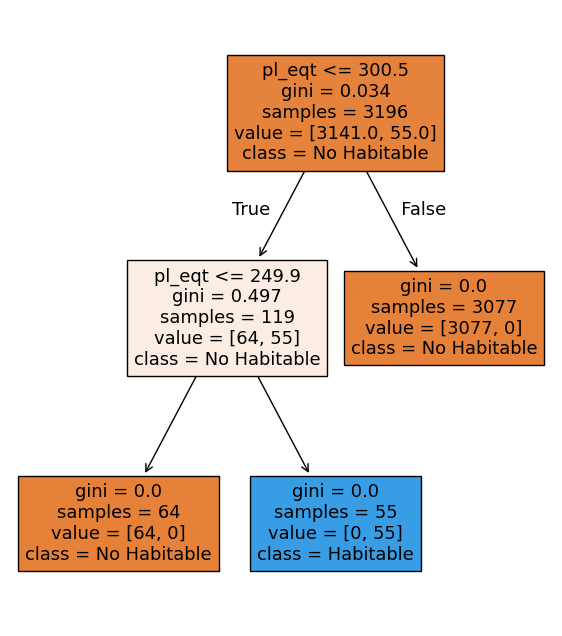

### Arboles de decisión

En este apartado exploraremos la viabilidad de un modelo de arboles de decisión para la clasificación de habitabilidad de exoplanetas.


Bien, ya vimos que al parecer con LDA, el modelo tiene muchos problemas para predecir la habitabilidad de los planetas, esto muy relacionado al fuerte desbalance de las clases.

Debido a esto, podemos probar un tipo diferente de modelo, en este caso utilizaremos arboles de desición, para ver si empeora o mejora.

### Crear modelo

>Python Code


```python
from sklearn.tree import DecisionTreeClassifier
from sklearn.metrics import classification_report, confusion_matrix, accuracy_score

# Crear modelo base
tree = DecisionTreeClassifier(
    random_state=42
)

# Entrenar
tree.fit(X_train, y_train)

# Predicciones
y_pred_tree = tree.predict(X_test)
```

> Nota: se definió: una semilla para el random state

### Ver matriz de confusión y reporte de clasificación

>Python Code


```python
print("Accuracy:", accuracy_score(y_test, y_pred_tree))

print("\nMatriz de Confusión:")
print(confusion_matrix(y_test, y_pred_tree))

print("\nReporte de Clasificación:")
print(classification_report(y_test, y_pred_tree))
```

>Output


```text
Accuracy: 0.9992700729927008

Matriz de Confusión:
[[1346    1]
 [   0   23]]

Reporte de Clasificación:
              precision    recall  f1-score   support

           0       1.00      1.00      1.00      1347
           1       0.96      1.00      0.98        23

    accuracy                           1.00      1370
   macro avg       0.98      1.00      0.99      1370
weighted avg       1.00      1.00      1.00      1370

```


> Nota: aqui podemos ver claramente que el modelo esta sobre ajustado ya que tenemos 100% de recall, F1 score y precisión.

Posiblemente esto haga que nuestros datos de test tengan resultados muy malos.

Una opción podria ser la poda de arboles, donde probemos distintos valores de alpha y ver cual se adecua mas a nuestro contexto. Basicamente probaremos valores de alpha hasta encontrar el mas optimo.


>Python Code


```text
path = tree.cost_complexity_pruning_path(X_train, y_train)
ccp_alphas = path.ccp_alphas

import numpy as np

test_scores = [clf.score(X_test, y_test) for clf in trees]

# Mejor alpha
best_alpha = ccp_alphas[np.argmax(test_scores)]
print("Mejor alpha:", best_alpha)

```


>Output


```text
Mejor alpha: 0.0
```


Aqui puede parecer que el mejor alpha haya dado 0, podria indicarnos que el arbol completo que tenemos desde un principio funciona mejor que las podas que hemos echo.


### Arbol Final

>Python Code


```python
final_tree = DecisionTreeClassifier(
    random_state=42,
    ccp_alpha=best_alpha
)

final_tree.fit(X_train, y_train)

y_pred_final = final_tree.predict(X_test)

print(classification_report(y_test, y_pred_final))

```

>Output


```text
              precision    recall  f1-score   support

           0       1.00      1.00      1.00      1347
           1       0.96      1.00      0.98        23

    accuracy                           1.00      1370
   macro avg       0.98      1.00      0.99      1370
weighted avg       1.00      1.00      1.00      1370

```


### Visualización del arbol de decisión




Vemos aqui claramente que el arbol es en escencia muy pequeño, de modo que es natural pensar que funcione mejor sin poda que con ella.

### Importante
 el árbol de decisión identifica inmediatamente la temperatura de equilibrio (pl_eqt) como la variable más relevante, utilizándola en el nodo raíz. Las divisiones posteriores reconstruyen prácticamente el mismo intervalo empleado para definir la variable de salida, generando nodos puros con impureza nula (gini = 0). Esto indica que el modelo reproduce exactamente la regla de clasificación utilizada den rango de temperatura para construir la variable objetivo.


----

# Evaluación y Comparación de los Modelos

## Métricas de desempeño

Las métricas fueron calculadas sobre el conjunto de prueba utilizando accuracy, precisión, recall, F1-score y matriz de confusión.

El modelo **LDA** obtuvo una exactitud de 98.17%; sin embargo, no logró identificar ningún planeta habitable (recall = 0 para la clase 1). Esto indica que, aunque clasifica correctamente la mayoría de los casos, falla completamente en detectar la clase minoritaria.

El **árbol de decisión**, al incluir la variable `pl_eqt`, logró una separación prácticamente perfecta, generando nodos puros (gini = 0) y reproduciendo el intervalo de temperatura utilizado para definir la habitabilidad.

---

## Coherencia entre visualización y métricas

En LDA, la proyección sobre la función discriminante mostró una fuerte superposición entre clases, lo cual explica el bajo desempeño en la detección de planetas habitables. La ausencia de separación geométrica se refleja directamente en las métricas.

En el árbol de decisión, la estructura basada en umbrales sobre `pl_eqt` mostró una separación clara y consistente con el alto desempeño observado.

---

## Influencia de los supuestos

LDA asume normalidad, igualdad de covarianzas y una frontera lineal. Estas condiciones limitan su capacidad para capturar reglas basadas en intervalos, especialmente bajo fuerte desbalance de clases.

El árbol de decisión no requiere supuestos de distribución y puede modelar fácilmente reglas tipo “si-entonces”, lo que lo hace más adecuado para este tipo de problema.

---

## Ventajas y limitaciones

**LDA**
- Modelo estable y con interpretación geométrica clara.
- Sensible al desbalance y a la no linealidad.

**Árbol de decisión**
- Alta interpretabilidad mediante reglas explícitas.
- Capaz de capturar umbrales directamente.
- Puede sobreajustarse si no se controla su complejidad.

---

## Conclusión

Para este problema específico, el árbol de decisión resulta más adecuado al capturar correctamente la regla de clasificación basada en temperatura. No obstante, su desempeño debe interpretarse considerando que utiliza directamente la variable con la cual se definió la clase objetivo.


El modelo LDA, aunque presenta alta exactitud global, demuestra limitaciones importantes en la detección de la clase minoritaria.

Para este tipo de analisis, primeramente se deberia de contar con una base de datos la cual no tenga un desbalance de clases tan notorio como lo fue en este caso, de modo que pueda permitirle al modelo tener mas observaciones de la categoria que si nos interesa, en este caso era "Habitable si/no".
